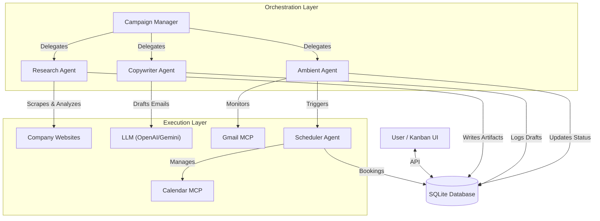

# DealFlow - Autonomous Sponsorship Swarm 🚀


**DealFlow** is a fully autonomous, multi-agent system designed to streamline the sponsorship outreach process. It orchestrates a swarm of AI agents to research potential sponsors, craft personalized outreach emails, negotiate terms, and schedule meetings—all managed through a real-time Kanban interface.

---

## 🏗️ System Architecture

DealFlow uses a **Hub-and-Spoke** architecture where a central Campaign Manager orchestrates specialized agents.



### 🤖 The Agent Swarm

1.  **Campaign Manager (The Boss)** 🎩
    *   **Role**: Orchestrator.
    *   **Function**: Monitors the pipeline, assigns tasks to worker agents, and ensures leads move from "Identified" to "Won".
    
2.  **Research Agent (The Analyst)** 🕵️
    *   **Role**: Intelligence gathering.
    *   **Function**: Visits sponsor websites, scrapes content, and uses LLMs to extract key info (recent news, tech stack, key decision makers).
    *   **Output**: A structured "Research Artifact" stored in the DB.

3.  **Copywriter Agent (The Creative)** ✍️
    *   **Role**: Content generation.
    *   **Function**: Reads the Research Artifact and crafts a highly personalized, warm, and professional outreach email.
    
4.  **Ambient Agent (The Watchdog)** 🐕
    *   **Role**: Monitoring & Reaction.
    *   **Function**: Continuously watches the inbox for replies. It classifies sentiment (Positive, Negative, Later) and triggers the next step.
    
5.  **Scheduler Agent (The Closer)** 📅
    *   **Role**: Logistics.
    *   **Function**: When a positive reply is detected, it interacts with the Google Calendar MCP to find free slots and book the meeting.

---

## 🛠️ Tech Stack

*   **Backend**: Python 3.10+
    *   **AI/LLM**: OpenAI GPT-4o, Google Gemini 1.5 Flash
    *   **Scraping**: BeautifulSoup4, Requests
    *   **Database**: SQLite (via `better-sqlite3` in Node, `sqlite3` in Python)
    *   **Tooling**: Custom MCP (Model Context Protocol) implementations for Gmail & Calendar
*   **Frontend**: Next.js 15 (App Router)
    *   **Styling**: Tailwind CSS
    *   **Language**: TypeScript
    *   **State**: React Hooks + Polling

---

## 🚀 Getting Started

### Prerequisites

*   Python 3.10 or higher
*   Node.js 18 or higher
*   (Optional) OpenAI API Key or Google Gemini API Key

### Installation

1.  **Clone the Repository**
    ```bash
    git clone https://github.com/Tejasv-Singh/DealFlow.git
    cd DealFlow
    ```

2.  **Backend Setup**
    ```bash
    # Create a virtual environment (recommended)
    python3 -m venv venv
    source venv/bin/activate
    
    # Install dependencies
    pip install -r requirements.txt
    ```

3.  **Frontend Setup**
    ```bash
    cd ui
    npm install
    ```

### Configuration

1.  Copy the example environment file:
    ```bash
    cp .env.example .env
    ```
2.  Edit `.env` and add your API keys:
    ```env
    # OpenAI (Recommended for best quality)
    OPENAI_API_KEY=sk-...
    
    # OR Gemini (Good alternative)
    GEMINI_API_KEY=AIza...
    ```
    *Note: If no keys are provided, the system runs in **Simulation Mode**, using mock data for demos.*

---

## 🏃‍♂️ Usage

### 1. Start the Backend Orchestrator
This starts the agent loop. It will seed test data if the database is empty.

```bash
# From the project root
python3 -m dealflow.orchestrator.main
```

### 2. Start the Frontend UI
Open a new terminal window.

```bash
cd ui
npm run dev
```

### 3. Interact
*   Open your browser to `http://localhost:3000`.
*   **Add a Target**: Enter a company name and website (e.g., "Stripe", "stripe.com") in the top bar.
*   **Watch it Work**:
    *   The card appears in **Identified**.
    *   Research Agent picks it up -> moves to **Researching**.
    *   Copywriter drafts email -> moves to **Contacted**.
    *   (Simulated) Reply received -> Ambient Agent moves to **Negotiating**.
    *   Scheduler books meeting -> moves to **Won**.

---

## 📂 Project Structure

```
dealflow/
├── agents/                 # 🧠 Brains of the operation
│   ├── campaign_manager.py # Main loop
│   ├── researcher.py       # Web scraping & analysis
│   ├── copywriter.py       # Email generation
│   ├── ambient.py          # Inbox monitoring
│   └── scheduler.py        # Calendar management
├── mcp/                    # 🛠️ Tools
│   ├── gmail.py            # Gmail interface
│   └── calendar.py         # Google Calendar interface
├── db/                     # 💾 Memory
│   ├── schema.sql          # Database structure
│   └── db_manager.py       # Python DB interface
├── orchestrator/           # 🎬 Entry point
│   └── main.py
└── ui/                     # 💻 Frontend
    ├── app/                # Next.js App Router
    └── components/         # React components
```

## 🤝 Contributing

Contributions are welcome! Please feel free to submit a Pull Request.

## 📄 License

This project is licensed under the MIT License.
