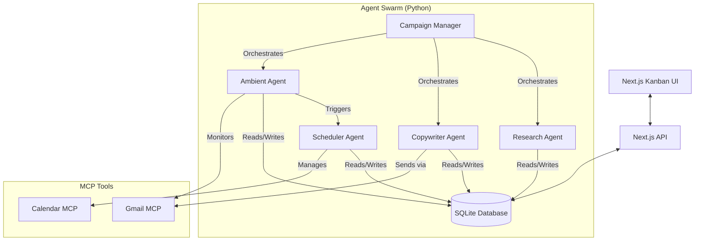

# DealFlow - Autonomous Sponsorship Swarm

DealFlow is a fully autonomous, multi-agent sponsorship outreach system. It orchestrates a team of AI agents to research, contact, and schedule meetings with potential sponsors, managed via a Kanban UI.

## Architecture



## Agents & Goals

1.  **Campaign Manager**: Primary orchestrator. Assigns tasks, manages pipeline state.
2.  **Research Agent**: Scrapes web/news for company info. Produces "Research Artifacts".
3.  **Copywriter Agent**: Generates personalized outreach emails based on research.
4.  **Ambient Agent**: Monitors inbox for replies. Detects intent (Yes/No/Later).
5.  **Scheduler Agent**: Negotiates times and books meetings via Google Calendar.

## MCP Tools

-   **Gmail MCP**: `send_email`, `read_inbox`, `monitor_thread`.
-   **Calendar MCP**: `get_free_slots`, `create_event`, `propose_slots`.

## Database Schema

-   `sponsors`: Company info and status (Identified, Researching, Contacted, Negotiating, Won).
-   `research_artifacts`: Stored research data.
-   `email_threads`: History of communication.
-   `meeting_slots`: Proposed and confirmed slots.
-   `long_term_memory`: Snoozed leads (e.g., "Contact in Q2").
-   `event_log`: System-wide audit trail.

## Folder Structure

```
dealflow/
├── agents/                 # Python Agent Implementations
├── mcp/                    # MCP Tool Definitions
├── db/                     # Database Manager & Schema
├── orchestrator/           # Main Entry Point
├── ui/                     # Next.js Frontend
│   ├── app/                # App Router & API
│   └── components/         # React Components
└── requirements.txt        # Python Dependencies
```

## Setup & Run

1.  **Backend**:
    ```bash
    # Install dependencies
    pip install -r requirements.txt
    
    # Run Orchestrator
    python3 -m dealflow.orchestrator.main
    ```

2.  **Frontend**:
    ```bash
    cd ui
    npm install
    npm run dev
    ```
    Access at `http://localhost:3000`.

## Workflow Logic

1.  **Identified**: User adds a sponsor via UI.
2.  **Researching**: Campaign Manager hires Research Agent.
3.  **Contacted**: Copywriter drafts email; sent via Gmail MCP.
4.  **Negotiating**: Ambient Agent detects reply; triggers Scheduler.
5.  **Won**: Meeting confirmed on Calendar.

